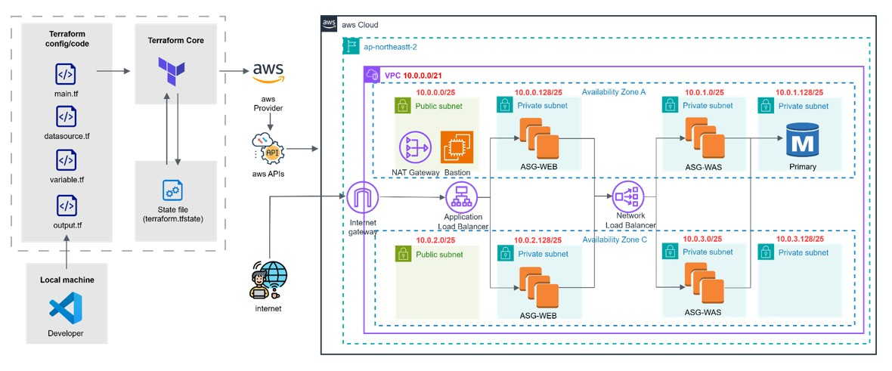

# Terraform으로 구현한 Petclinic 인프라

☁️ Petclinic 애플리케이션을 위한 AWS 인프라를 Terraform으로 구성한 코드 아카이브입니다.  
학습 및 실습 과정에서 작성된 코드 구조를 그대로 정리하였습니다.  

---

## 📝 개요
- AWS 기반 3-Tier 아키텍처 (VPC, Subnet, Bastion, ALB, ASG, RDS)  
- Terraform 모듈화 구조 적용 (network, bastion, asg, db 등)  
- `dev` 환경 기준으로 구성  

---

## 🏛️ Architecture


구성 요소:
- **VPC & Subnets**: 멀티 AZ 퍼블릭/프라이빗 서브넷  
- **Internet/NAT Gateway**: 인터넷 인바운드/아웃바운드 트래픽 처리
- **Load Balancer**: ALB는 웹 계층, NLB는 WAS 계층 분산 처리
- **Auto Scaling Groups**: Web 및 WAS 계층 확장/축소
- **RDS**: DB 계층 (Primary Instance)  
- **Bastion Host**: 운영/관리 접속  

---

##  Terraform 구성
```bash
terraform-petclinic/
├── dev/                  # 부모 모듈 (환경별 구분, dev/prod 등)
│   ├── asg/              # 오토 스케일링 그룹
│   ├── bs/               # 베스천 호스트
│   ├── db/               # 데이터베이스
│   ├── lb/               # 로드 밸런서
│   └── network/          # VPC, 서브넷, 라우팅, 보안 그룹
│
└── modules/              # 재사용 가능한 하위 모듈
    ├── asg/
    ├── bs/
    ├── db/
    ├── lb/
    └── network/
        ├── nat/          # NAT 게이트웨이
        ├── route/        # 라우팅 테이블
        ├── sg/           # 보안 그룹
        ├── snet/         # 서브넷
        └── vpc/          # VPC
```
---

### 🗒️ 메모
- **모듈화 아키텍처 장점**  
  안정성(변경 영향 최소화), 협업 용이성, 높은 재사용성  

- **모듈화 아키텍처 단점**  
  초기 구조 설계가 복잡하고, 의존성 관리 필요  

- **Terraform 상태 관리 (S3 백엔드 사용)**  
  - 상태 파일을 중앙 집중화하여 안전한 협업 가능  
  - 잠금 기능을 통해 충돌 방지  
  - 버전 관리 및 재해 복구 용이  

---

## 📎 참고사항
- 종료된 학습용 인프라 코드이며, 현재는 실행되지 않습니다.  
- 구조 참고 및 아카이브 목적입니다.  
